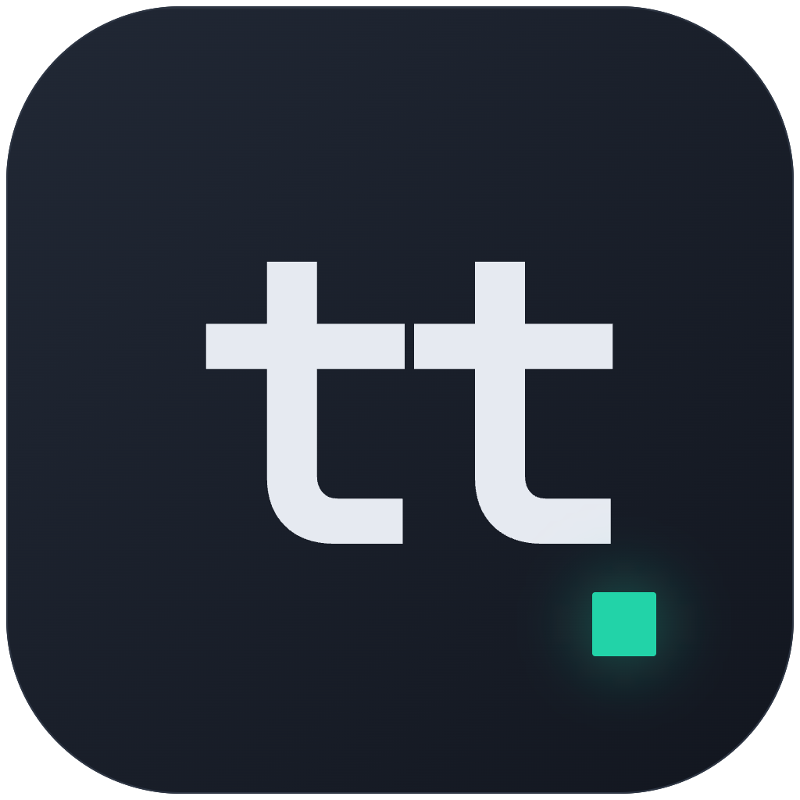
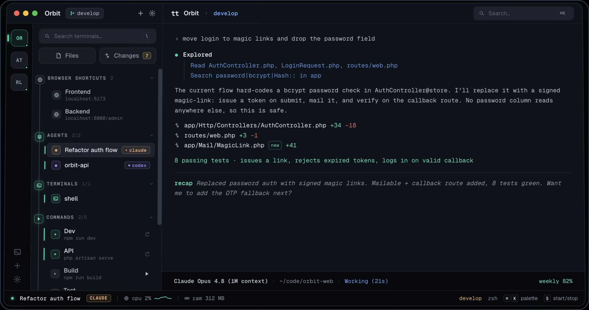
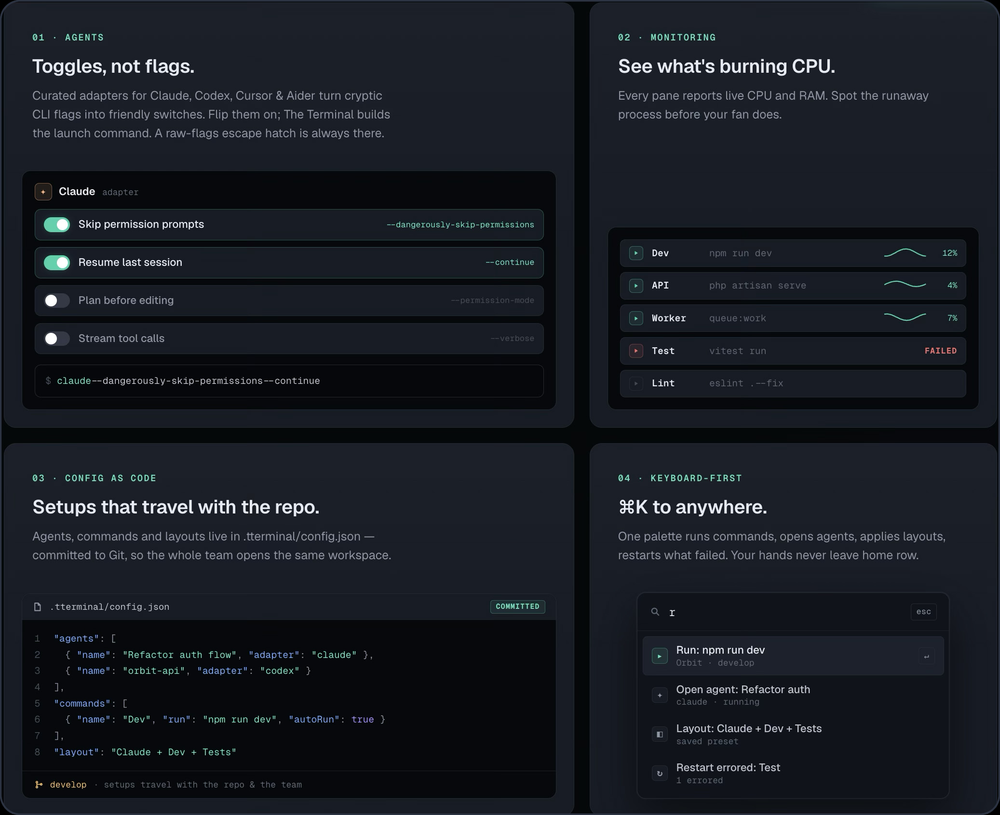

<div align="center">



# tterminal

**Your terminals, agents, and ideas — one command center.**

A native desktop workspace for AI-assisted developers — multi-pane terminals,
one-click agent presets, live process monitoring, a built-in scratchpad for
notes and to-dos, and quick browser shortcuts to your running apps.

<br/>

[](https://github.com/mijren/tterminal-releases/releases/latest/download/tterminal-macos-aarch64.dmg)
&nbsp;
[](https://tterminal.app)

Current public beta: `v0.7.4` &nbsp;·&nbsp; [tterminal.app](https://tterminal.app) &nbsp;·&nbsp; [All releases →](https://github.com/mijren/tterminal-releases/releases)


</div>

<br/>

<div align="center">
  
</div>

---

## Why tterminal

Modern AI-assisted development means running a dev server, a test watcher, a
database, a browser, and one or more agent CLIs — all at once. tterminal gives
those moving parts a single, keyboard-driven project workspace, so you stop
juggling terminal tabs and start steering everything from one place.

- 🧩 **Agents as toggles, not flags** — curated adapters for Claude, Cursor, Aider, and Codex turn cryptic CLI flags into friendly switches.
- 📡 **Live resource visibility** — per-pane CPU sparklines and RAM, so you spot the runaway process before your fan does.
- 📝 **Scratchpads, notes & to-dos** — a built-in notebook to capture ideas, tasks, and running notes right beside your work.
- 🔗 **Browser shortcuts** — one-click links to your running apps (frontend, backend, admin) without leaving the workspace.
- 📦 **Config as code** — agent setups, commands, and layouts live in the repo and travel with the whole team.
- 🪶 **Native & light** — built on Tauri (Rust + system webview), ~50 MB, not a 150 MB Electron app.
- 🔒 **No telemetry** — no terminal content, command output, environment variables, or file paths are ever collected.

<br/>

<div align="center">
  
</div>

---

## Download

- **[tterminal.app](https://tterminal.app)** — the official website: features, screenshots, and the latest download.
- **[Download for macOS Apple Silicon](https://github.com/mijren/tterminal-releases/releases/latest/download/tterminal-macos-aarch64.dmg)** — the current public beta DMG.
- **[View all releases](https://github.com/mijren/tterminal-releases/releases)** — full version history and changelogs.

The app is not distributed through the App Store.

## Online Updates

Starting with `v0.6.0`, tterminal includes signed online updates through Tauri's
updater. Once you're on `v0.6.0` or later, future versions download and install
over the internet from inside the app.

Users on builds before `v0.6.0` must install `v0.6.0` manually once. After that,
updates are automatic.

Updater manifest:

```text
https://github.com/mijren/tterminal-releases/releases/latest/download/latest.json
```

## Platform Status

| Platform | Status |
| --- | --- |
| macOS Apple Silicon | Public beta |
| macOS Intel | Planned |
| Linux | v1.x roadmap |
| Windows | v2 roadmap |

## Privacy

tterminal is built for local developer workflows.

- No in-app analytics.
- No terminal content, command output, environment variables, or file paths are
  collected for analytics.
- GitHub Releases may report download counts.
- Crash reporting, when added, will be opt-in and scrub terminal/project data.

---

<div align="center">
  <sub><a href="https://tterminal.app"><strong>tterminal.app</strong></a> · © 2026 Kuwait Solutions Experts Company · <a href="https://kuwaitse.com">kuwaitse.com</a> · All rights reserved.</sub>
</div>
